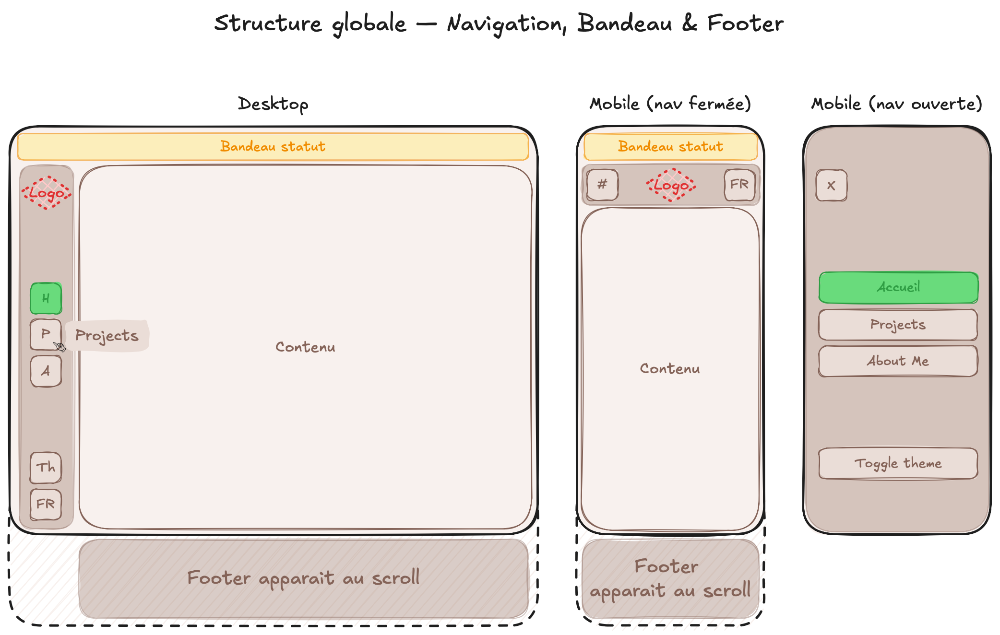
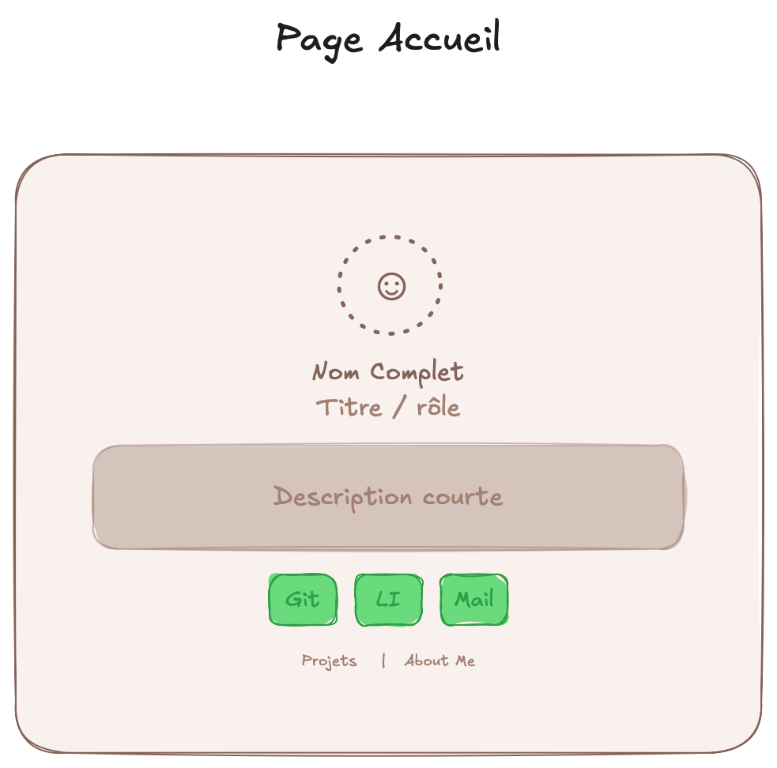
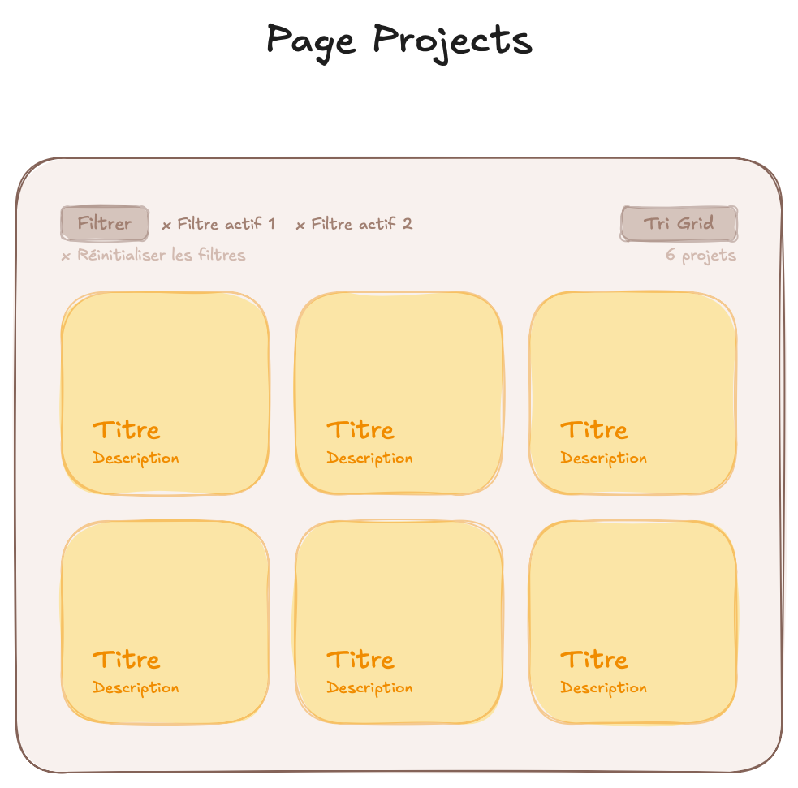
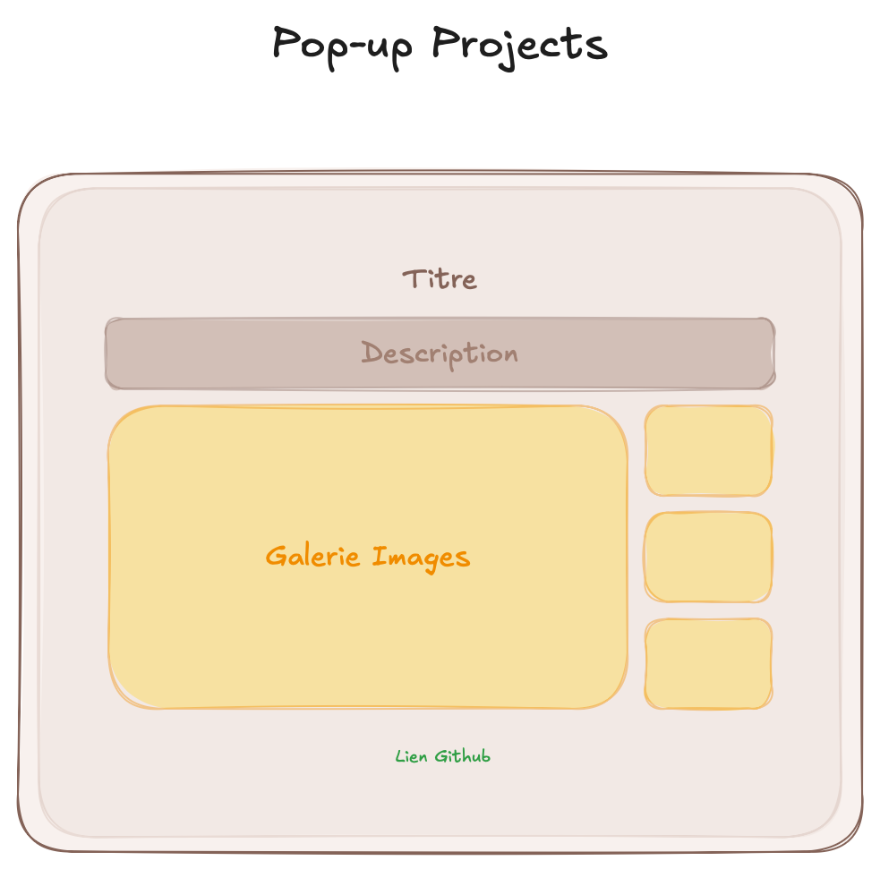
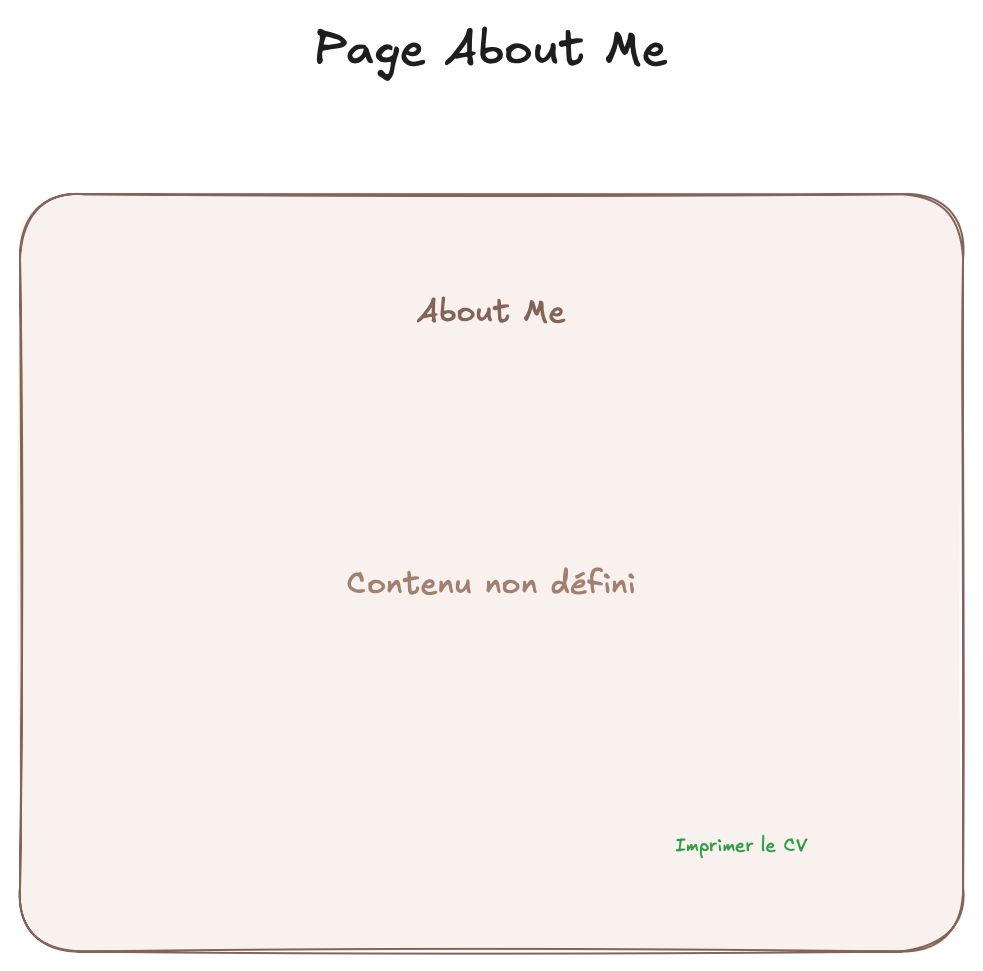
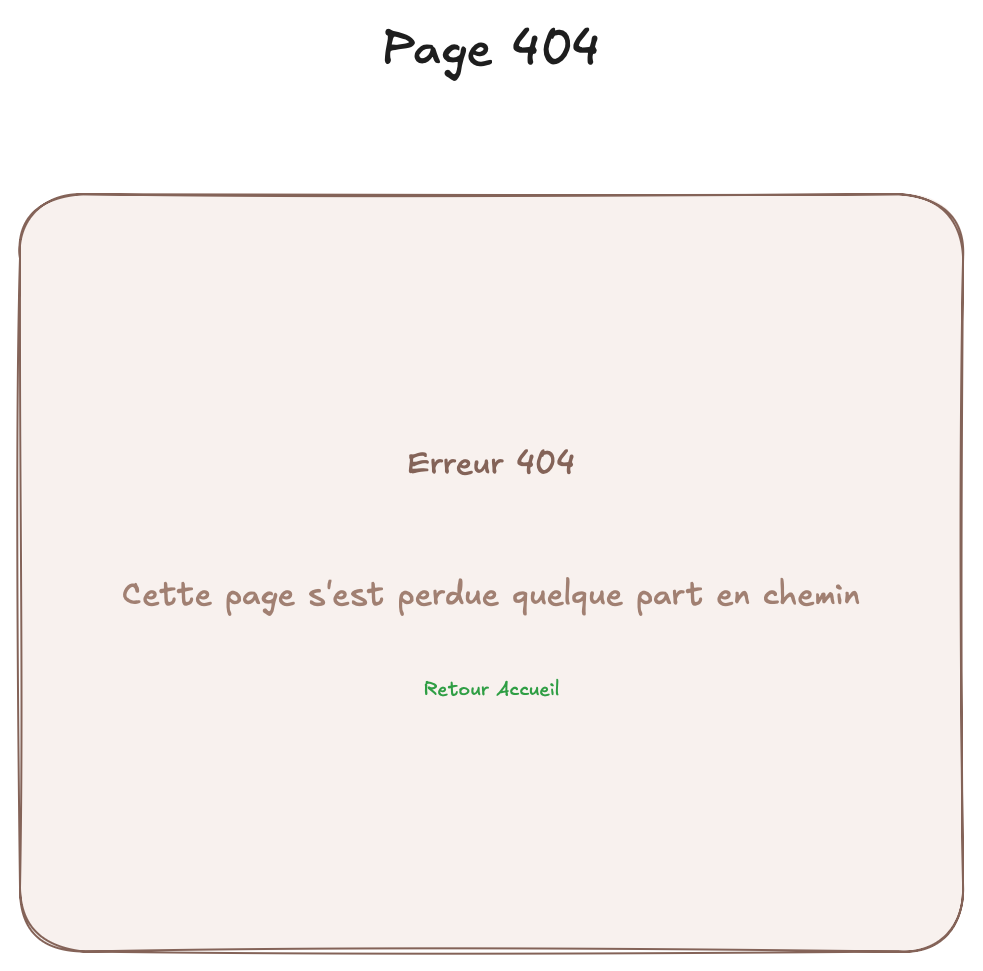

# Spécifications techniques - Portfolio Adèle
Document de spécifications techniques : présente la stack technique, la structure de l'interface, le contenu des pages, la structure des données, le responsive, l'accessibilité et l'identité technique du projet.

**Version** : v1.0

## 1. Stack technique
**Framework** : Vue 3 (Composition API, `<script setup>`)

**Build tool** : Vite

**Routing** : Vue Router 4, mode `history` (pas `hash`)

**Internationalisation** : vue-i18n (FR / EN) — langue par défaut détectée depuis la langue du navigateur du visiteur, avec repli sur l'anglais si non détectée/non supportée

**Design System** : Tailwind CSS

**Icônes** : Lucide (traits fins et arrondis, cohérents, open source)

**Gestion d'état** : pas de state manager lourd nécessaire ; un simple composable suffit pour persister thème/langue en localStorage

**À éviter explicitement** : tout state manager lourd non justifié

## 2. Structure globale de l'interface
*Éléments visibles/persistants sur toutes les pages.*



### 2.1 Bandeau de statut (haut de page)
**Format & Position** : bandeau fixe (sticky) en haut de la page, hauteur compacte

**Contenu** : Indicateur de disponibilité : texte modifiable selon la situation réelle, valeurs possibles : *"En recherche de stage"* (période de recherche active) ou *"Ouverte aux opportunités"* (par défaut le reste du temps)

### 2.2 Navigation — Desktop
Barre verticale fixe sur le bord gauche de l'écran, icônes uniquement (pas de texte visible par défaut)

**Logo** en haut de la barre, ramène à la page d'accueil au clic

**Pages** (dans l'ordre) :
  1. Accueil
  2. Projects
  3. About Me

**Indicateur de page active** : changement de couleur de l'icône

**Comportement au survol** : au survol d'une icône, le texte du label apparaît directement à côté de l'icône — pas d'animation de transition, apparition/disparition immédiate

### 2.3 Navigation — Mobile
Sur mobile, la navigation se répartit en deux zones : une barre du haut toujours visible, et un menu plein écran qui s'ouvre au clic sur le burger.

**Barre du haut** : fixe/sticky, hauteur compacte (cohabite avec le bandeau de statut 2.1 au-dessus)
  - Bouton burger à gauche
  - Logo centré (ramène à l'accueil)
  - Toggle langue (FR/EN) à droite, visible sans ouvrir le menu

**Menu burger** :
  - Ouverture : plein écran, glisse depuis la gauche (même côté que le bouton)
  - Fermeture : bouton croix uniquement, à gauche (même emplacement que le bouton burger)
  - Contenu : liste des pages (Accueil, Projects, About Me), chaque item = icône + label côte à côte (texte toujours visible, pas seulement au survol)
  - Page active : même effet colorée qu'en desktop
  - Toggle thème clair/sombre inclus dans le menu
  - Pas de logo dans le menu (déjà visible sur la barre du haut, pour éviter la surcharge visuelle)

### 2.4 Contrôles globaux
**Toggle langue** : FR / EN, affiche "FR" ou "EN" selon la langue active — accessible directement (barre desktop, ou barre du haut en mobile)

**Toggle thème** : clair / sombre (icône soleil/lune), préférence sauvegardée en localStorage, respecte `prefers-color-scheme` au premier chargement — accessible directement en desktop, dans le menu burger en mobile

### 2.5 Footer
Apparait au scroll.
```
Adèle — Portfolio
Conçu et développé avec Vue.js — avec l'aide de Claude et GitHub Copilot
© 2025 Adèle Ponge
vX.X · Dernière mise à jour : [générés automatiquement — voir section 7]
```

## 3. Contenu et fonctionnalités par page

### Page 1 — Accueil



**Contenu** :
- Avatar/photo
- Nom complet
- Titre / rôle (ex: "Étudiante en informatique / Développeuse front-end")
- Description courte
- Réseaux sociaux : GitHub, LinkedIn, email (lien `mailto:`)
- Liens rapides vers les autres pages

**Fonctionnalités spécifiques** : *(à définir)*

---

### Page 2 — Projects



**Contenu — En-tête de la page** :
- Compteur de projets, dynamique selon les filtres actifs (ex: "8 projets" → se met à jour en temps réel si un filtre est appliqué)
- Filtres actifs (tags, statut, tech stack, période, rôle)
- Bouton "Réinitialiser les filtres" (visible uniquement si un filtre est actif)
- Tri des projets

**Contenu — Grille de projets** :
- Titre
- Description courte
- Tech stack (tags visuels)
- Statut
- Tag de catégorie



**Contenu — Pop-up détail projet** :
*Ordre des éléments à définir*
- Titre
- Description longue
- Tech stack (tags visuels)
- Rôle (solo / équipe + rôle précis)
- Période
- Statut
- Liens GitHub / démo (si disponible)
- Images
- Défis techniques rencontrés
- Tag de catégorie

**Style du pop-up** : Quasi plein écran, bords arrondis, avec la page en arrière-plan floutée.

**Fonctionnalités spécifiques** :
- Grille de cards filtrable, **filtres générés automatiquement** à partir des données présentes dans `projects.json` (pas de liste figée à l'avance) :
  - Par tags/catégorie
  - Par statut (Terminé / En cours / Abandonné)
  - Par tech stack (langage/techno)
  - Par période/année
  - Par rôle (solo / équipe)
- Tri des projets : plus récent / plus ancien

---

### Page 3 — About Me



**Contenu** :
- Parcours académique (formation)
- Expériences professionnelles
- Compétences techniques (langages, web, bases de données, outils, gestion de projet, bureautique)
- Langues parlées
- Certifications / distinctions
- Centres d'intérêt
- Bouton de téléchargement du CV (PDF)

**Fonctionnalités spécifiques** : *(à définir)*

---

### Page Not Found (404)



**Contenu** :
- Message d'erreur 404 poétique, dans l'esprit du site (ex : *"Cette page s'est perdue quelque part en chemin"*)
- Bouton pour revenir à l'accueil

*(Mécanisme technique de mise en place → voir section 7)*

## 4. Structure de données

**Format des fichiers** : `.json` pour l'ensemble des données locales, un fichier par type d'entité (et non par page) :
- `identity.json` — identité personnelle : nom, headline, bio, avatar, localisation, contacts, langues parlées, centres d'intérêt. Consommé par Accueil, About Me (en-tête) et le futur générateur de CV.
- `education.json` — parcours académique (liste). Consommé par About Me et le futur CV.
- `experience.json` — expériences professionnelles (liste). Consommé par About Me et le futur CV.
- `skills.json` — compétences techniques (par catégorie) + certifications (au sens large : diplômes, permis, habilitations). Consommé par About Me et le futur CV.
- `projects.json` — projets (liste). Consommé par Accueil (filtré sur `featured: true`) et Projects.

### Gestion multilingue du contenu
Tous les champs de texte destinés à être lus par un visiteur (titres, descriptions, libellés de période...) sont des objets `{ fr, en }`. Les champs techniques (id, dates au format YYYY-MM, URLs, chemins d'images, tags de filtrage) restent en valeur simple, non traduits.

### identity.json
```json
{
  "fullName": "string",
  "headline": { "fr": "string", "en": "string" },
  "bio": { "fr": "string", "en": "string" },
  "avatar": "string (chemin image)",
  "location": { "city": "string", "country": "string", "timeZone": "string" },
  "socialLinks": { "github": "string", "linkedin": "string", "email": "string" },
  "spokenLanguages": [
    { "language": { "fr": "string", "en": "string" }, "level": { "fr": "string", "en": "string" } }
  ],
  "interests": [{ "fr": "string", "en": "string" }]
}
```

### education.json
```json
[
  {
    "id": "string",
    "degree": { "fr": "string", "en": "string" },
    "institution": "string",
    "location": "string",
    "startDate": "string (YYYY-MM)",
    "endDate": "string (YYYY-MM) | null",
    "description": { "fr": "string", "en": "string" }
  }
]
```

### experience.json
```json
[
  {
    "id": "string",
    "role": { "fr": "string", "en": "string" },
    "organization": "string",
    "location": "string",
    "startDate": "string (YYYY-MM)",
    "endDate": "string (YYYY-MM) | null",
    "description": { "fr": "string", "en": "string" }
  }
]
```

### skills.json
```json
{
  "skills": {
    "languages": ["string", "..."],
    "web": ["string", "..."],
    "databases": ["string", "..."],
    "specializedTools": ["string", "..."],
    "projectManagement": ["string", "..."],
    "office": ["string", "..."]
  },
  "certifications": [
    { "title": { "fr": "string", "en": "string" }, "issuer": "string | null", "date": "string (YYYY-MM) | null", "credentialId": "string | null", "credentialUrl": "string | null" }
  ]
}
```
*`certifications` regroupe aussi bien les certifications logicielles (Pix, Mimo) que les diplômes/habilitations type PSC1 ou permis de conduire — même nature d'info (un titre + un émetteur), donc même structure plutôt qu'un fichier ou champ dédié en plus.*

### projects.json
```json
{
  "id": "string",
  "title": { "fr": "string", "en": "string" },
  "shortDescription": { "fr": "string", "en": "string" },
  "longDescription": { "fr": "string", "en": "string" },
  "techStack": ["string", "..."],
  "role": { "fr": "string", "en": "string" },
  "startDate": "string (YYYY-MM)",
  "endDate": "string (YYYY-MM) | null",
  "periodLabel": { "fr": "string", "en": "string" },
  "status": "string — 'done' | 'in_progress' | 'abandoned'",
  "githubUrl": "string",
  "demoUrl": "string | null",
  "images": [
    {
      "src": "string",
      "alt": { "fr": "string", "en": "string" }
    } 
  ],
  "challenges": { "fr": "string", "en": "string" },
  "tags": ["string", "..."],
  "featured": "boolean — true si le projet doit apparaître en avant sur l'Accueil (défaut: false)"
}
```

## 5. Responsive
**Outil** : Tailwind CSS — breakpoints par défaut (`sm` 640px, `md` 768px, `lg` 1024px, `xl` 1280px), pas de personnalisation dans `tailwind.config.js`

**Approche** : mobile-first — les classes sans préfixe s'appliquent par défaut (mobile), les préfixes (`md:`, `lg:`...) ajoutent des styles à partir de la largeur correspondante

**Comportement navigation** : menu burger par défaut (mobile + tablette portrait, ex: iPad ~768px) → barre verticale à partir de `lg` (1024px, tablette paysage et plus)

**Comportement grilles** (Projects) : colonne unique par défaut → multi-colonnes à partir de `md`/`lg` (nombre de colonnes exact à définir au moment du code)

**Contrainte générale** : aucun scroll horizontal, quelle que soit la taille d'écran

## 6. Accessibilité & contraintes techniques
**Techniques non-négociables** :
  - Pas de backend, pas d'API, pas de base de données pour cette version
  - Contenu en dur dans des fichiers JSON locaux (`src/data/`)
  - Code propre, commenté, organisé en composants réutilisables (`components/`, `views/`, `composables/`, `locales/`, `data/`)
  - Textes de contenu placeholders clairement identifiables tant qu'ils ne sont pas remplacés par le contenu réel
  - Images optimisées pour le web (format `AVIF` pour photos et captures d'écran, `SVG` pour logo/icônes) avec Squoosh.
  - Auto-hébergement des polices Google Fonts (Tsukimi Rounded, Zen Maru Gothic, Noto Sans JP) — fichiers téléchargés et servis directement depuis le site, pas de chargement via le CDN Google, pour respecter le RGPD (site basé en France/UE, évite l'envoi de l'IP des visiteurs à Google)

**Accessibilité** : niveau **WCAG AA** visé, notamment :
  - Contraste texte/fond suffisant (ratio ≥ 4.5:1)
  - Texte alternatif (`alt`) sur toutes les images
  - Navigation complète au clavier (Tab, Entrée, Échap pour fermer menu/pop-up)
  - Structure sémantique correcte (titres hiérarchisés, landmarks `<nav>`/`<main>`)
  - Focus visible sur les éléments interactifs
  - `aria-label` sur les boutons icône seule (toggle thème, toggle langue, burger)

## 7. Identité technique & méta
**Titre de l'onglet du navigateur (`<title>`)** : `<Portfolio owner="Adèle" />` — identique sur toutes les pages puisque c'est une SPA ; mise à jour dynamique de `document.title` si besoin, mais contenu affiché toujours identique

**Favicon** :


**Logo** : *(à créer)*


**Repo GitHub** : [`adele25p/adele25p.github.io`](https://github.com/adele25p/adele25p.github.io) — repo "utilisateur", le site est donc servi directement à la racine `https://adele25p.github.io/` (pas de sous-dossier, pas de `base` particulier à configurer dans `vite.config.js`)

**Stratégie de branches** : une branche par grande version (`v0` actuellement sur `main`, `v1` en cours) ; `main` sera basculée sur `v1` une fois la v1.0 terminée

**Méthode de test avant mise en prod** : création d'un repo GitHub jetable de test, supprimé une fois les tests terminés — évite les déploiements cassés visibles sur le repo final

**Déploiement** : GitHub Actions, à partir du template [`adele25p/pages-build-deployment-vue-spa`](https://github.com/adele25p/pages-build-deployment-vue-spa) — fichier `.github/workflows/deploy.yml` réutilisé tel quel (quick usage)

**Version et date dans le footer (100% automatisées, aucune intervention manuelle)** :
  - La version (`vX.X`) est générée automatiquement au build à partir du dernier tag Git (ex. via `git describe --tags`), et non plus lue/éditée manuellement dans `package.json` — créer un nouveau tag Git suffit à faire évoluer le numéro affiché
  - La date de dernière mise à jour est générée automatiquement au build à partir de la date du dernier commit Git (ou de la date de build)
  - Les deux valeurs sont injectées au moment du build (ex. variables d'environnement Vite) — aucun fichier à modifier à la main pour publier une nouvelle version

**Page 404** : nécessaire techniquement car le routing est en mode `history` : une page Not Found avec les autres pages, + une route "attrape-tout" (`path: '/:pathMatch(.*)*'`) dans Vue Router affichant la page 404 custom *(contenu de la page → voir section 3)*